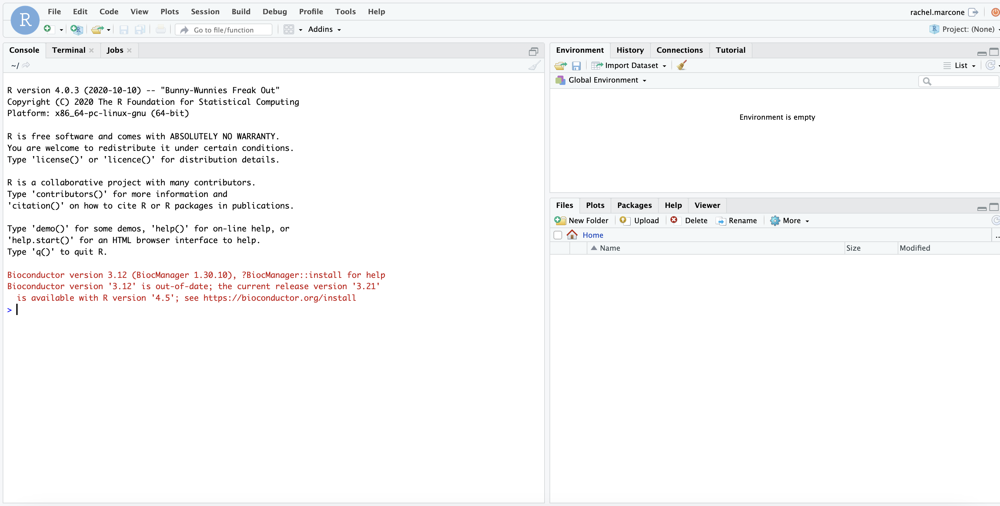
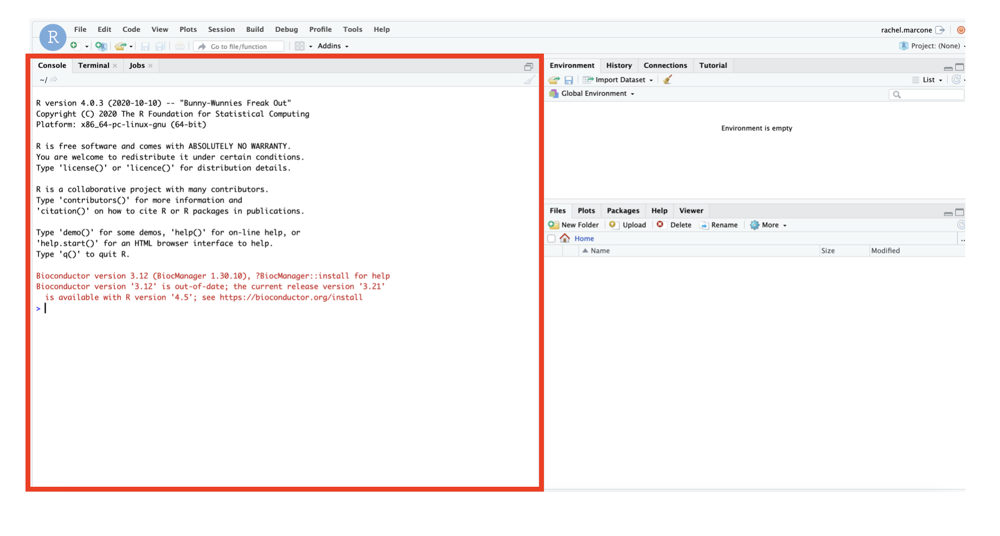
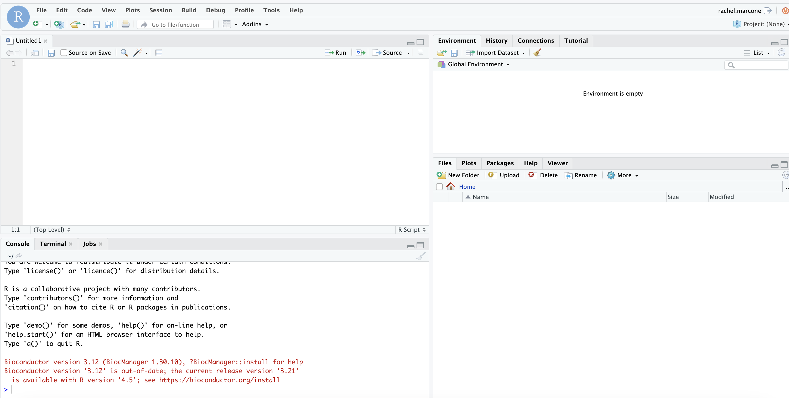

# Descriptive Statistics and Exploratory Data Analysis

## Learning outcomes of the day

**After having completed this chapter you will be able to:**

- Start an analysis in R / First steps in R
- Visualise your data with a few simple commands
- Summarise your data
- Load data into R from a file (for example a CSV file)
- Understand basic plotting


## Material

In this section, you will find the R code that we will use during the course. We will explain the code and output during correction of the exercises.

Slides of lectures:
[Download slides Introduction Lecture](assets/pdf/Intro_IS25.pdf){: .md-button }

[Download slides Morning Lecture](assets/pdf/Exploratory data analysis_25.pdf){: .md-button }

[Download slides Help for first steps in R](assets/pdf/Data_analysis_with_R _25.pdf){: .md-button }

[Download slides Afternoon Lecture](assets/pdf/Introduction_to_hypothesis_testing_25.pdf){: .md-button }

Data for exercises:

[Download full data for the week](assets/exercises/Exercises_IS.zip){: .md-button }


## First hands on in R


The purpose of this exercise is to introduce you to using R for statistical analysis of data. Code that you can copy and paste is provided here to get you started. You will get the most out of the session if you also do some exploring on your own: check the help files for each function to learn what default values and optional arguments are there, and try out your own variations.


### Preliminaries: Getting help in R


To proceed, you will need to start R. We asked you to install RStudio as this is an integrated development environment that makes it easy to write, debug, and visualize data analysis and statistical computing projects in R.

You should be able to see the following page

<figure>
  
  </figure>
  


In red, you can find the console. Inside, we will write all the commands. They need to come after the ">" sign.


<figure>
  
  </figure>
  


For best practice always open a new Rscript to write all your commands that you run in your console. This enables reproducibility and follows the FAIR rules (Findable, Accessible, Interoperable, and Reusable). For that press "File/New File/RScript". 


<figure>
  
  </figure>
  
  

You now have on the top left, the Untitled (try to save it!) file that you can later re-open when you want to come back to this script.

On the top right, you can find the environment, i.e. all the available objects. At the moment, this is empty. 


Try to write the first command, just a calculation

```r
2+2
```


The # sign indicates a comment: anything occurring after this sign on a line is ignored by R (but can be very useful in programming at it provides a means for documenting your code). 

??? Hint
    Practice this throughout the course!
    

Therefore the following line gives exactly the same result as before. 

```r
2+2 # This is just a simple calculation 
```

You should become acquainted with the help facility within R, it can be your friend! The basic help command is

```r
help()
```

within the parentheses you would type (inside of double quotes) the name of a function whose help file you want to see, e.g.

```r
help("mean")
```

You can also use the alternative syntax 
```r
?mean
```

If you don't know the exact command name, use

```r
help.search()
```

with the name of the concept inside double quotes within the parentheses.


### Getting Data into R

R has a number of functions to create data vectors, including: c(), seq(), rep(). Find out what each of these do, and make some data vectors of your choice using each.

To get some practice using statistical functions and performing small calculations in R, create a weight and corresponding height vector for computing body mass index (bmi) (this example is inspired by Dalgaard's book, Introductory statistics with R):

```r
weight <- c(65,72,55,91,95,72)
height <- c(1.73, 1.80, 1.62, 1.90, 1.78, 1.93)
bmi <- weight / height^2
bmi # Type this in R to see the computed values
```


These data vectors are a little too small to really require summaries. It is a little more interesting to look at real data.


## Hellung Data

We are going to load the package ISwR, and examine the variables in the data set hellung.

First, we need to make sure the package is installed. From R Studio, you can go to the menu Tools -> Install packages..., and then choose the package you need installed. Using the RGui under Windows, you can go to menu Packages -> Install package(s) In the console, you can use the install.packages command: install.packages("ISwR"). R packages have an explanation on installation, which you can find in each help manual of the package. Once installed you can load the library as well as the data hellung.

```r
library(ISwR)
?hellung
data(hellung)
```

### Univariate numerical summaries

You can find the variable names with 
```r
names(hellung)
```
... and can summarize the data set with 

```r
summary(hellung)
```

All good ?

Also compute the mean and sd for each variable. Which of the variables does it not make sense to summarize like this?

### Univariate graphical summaries

Make histograms of each of the variables.

```r
par(mfrow=c(2,2)) # for viewing multiple plots (2 rows x 2 columns = 4 plots)
hist(hellung$conc)
hist(hellung$diameter)
hist(hellung$glucose)
```

Make a boxplot of the variable conc. Now, make side by side boxplots of conc, one for each value of glucose; do the same with diameter. Note: the conc ~ glucose notation means "explain conc according to glucose"; it tells R that it should split the boxplot according to the different values of the "glucose" variable.

```r
par(mfrow=c(2,2)) # for viewing multiple plots
boxplot(conc ~ glucose, data=hellung)
boxplot(diameter ~ glucose, data=hellung)
```

Does the distribution (pattern of variability) of either variable appear to depend on the presence or absence of glucose? Do we have enough information to decide whether glucose is causing any difference?

### A bivariate look

It is also interesting to further explore relationships between different variables. We have already looked informally at the relationship between glucose and the other variables. We can also explore the relationship between the numerical variables conc and diameter:

```r
cor(hellung$conc, hellung$diameter)
plot(diameter ~ conc, data=hellung)
```

Do you see any structure in the scatterplot? What happens if we take log(conc) instead of conc?


## Importing and exporting data into R

Usually, the data to be analysed in R is already available in another program, typically Excel, and must be imported into R.

You can read many different file formats in R, including text files and Excel files. However, since Excel files can be complex (including, for example, merged cells that are hard to understand), it is recommended in most cases to export them to text format first, either "CSV" (Comma-separated variables) or "tab delimited", and to make sure that the result is correct, before loading them into R.

Typical R commands for reading these files are read.table, read.delim, read.csv. The help pages can tell you the differences between these commands, but read.csv is the one to use for CSV files.

One important caveat is the configuration of your computer with regards to the decimal point: if Excel saves files using commas for the decimal separator (e.g. 10,00 instead of 10.00), R will not recognize the data as numbers because of the "parasite" character. The option dec = "," can be used if necessary to modify this behaviour.

Conversely, the write.table command can be used to write a table to a file for subsequent reading into Excel. When using R studio, you can use the "import dataset" tool, that will allow you to explore the structure of the data you import. A useful feature of this tool is that, when finished, it will not only load the data, but will also print the actual R command that was used to do so, allowing you to copy it to your script for future use. Note: recent versions of R Studio load data into a variable that is not a data frame, but a more advanced structure. The resulting variable works mostly like a data frame, but there are some differences. If you have any issue, try converting it back to a data frame. For example, if you loaded data using the importer tool, you can convert it to a data frame using data2 <- as.data.frame(data)

### Looking at some unknown data

The data for this exercice is provided in an Excel file, data.xls. You need to export this files from Excel to either CSV or text (tab-delimited) files, and then read it in R using one of the following commands:
```r
data <- read.table("data.txt", header=TRUE)  # Reads a tab-delimited file and tells R that
# the first line actually contains a header
```

```r
data <- read.csv("data.csv")                 # Reads a CSV file
```

The file contains three datasets in three columns of the file. Start by looking at some summaries of the data:

```r
data
summary(data)
sd(data[,1]); sd(data[,2]); sd(data[,3])
```

What comment can you make about these datasets ?

The individual datasets can be accessed by using one of the (equivalent) commands

```r
data$data1   # Column named "data1"
data[,1]     # First column (= column "data1")
```

It may be easier to copy them in separate variables:
```r
data1 <- data$data1
summary(data1)
```
or, equivalently:
```r
attach(data)
summary(data1)
```

While these numbers are interesting, they are only a very short summary of the data, as you know by now. We are going to plot the data in several different ways.
Firstly, let us plot the usual barplot with standard deviation; is it very informative ?

```r
means <- as.vector(colMeans(data))  # means for the 3 datasets
sds <- as.vector(sapply( data, sd))      # SDs for the 3 datasets
# bp will contain the x coordinates of the three barplots
# ylim is used to make sure that some space is left for the error bar
bp <- barplot(means, ylim=1.1*range(0, means+sds), names.arg=c("Data1", "Data2", "Data3"))
arrows(as.vector(bp), means, as.vector(bp), means+sds, angle=90, code=3)
```

Let us look at 4 different ways of plotting the data. In the case of the histogram, you can change the number of bars if necessary by adding the argument breaks=n.

```r
datatoplot <- data[,1]
```

### Plot 4 rows of graphs on one plot

```r
par(mfrow=c(4,1))
```

1st plot: individual points on the x-axis; random noise on the y-axis so that points are not too much superimposed
```r
plot(datatoplot, runif( length(datatoplot), -1, 1), xlim=range(datatoplot))
```

2nd plot: histogram, with the density line superimposed
```r
hist(datatoplot, freq=F, xlim=range(datatoplot))
lines(density(datatoplot))
```

3rd plot: average +/- Sd
```r
plot(mean(datatoplot), 0, xlim=range(datatoplot), main="Mean and standard deviation of a")
arrows(mean(datatoplot)-sd(datatoplot), 0, mean(datatoplot)+sd(datatoplot), 0, angle=90, code=3)
```

4th plot: boxplot
```r
boxplot(datatoplot, horizontal=TRUE, ylim=range(datatoplot))
```

Do these plots for the three different datasets. Are there cases where some plots are more adapted to the data than others ? What about the number of bars in the histograms ?


## Testing the mean of a normally distributed dataset

This is a small exercise to understand normally distributed data and t-tests.

First, let us create a set of normally distributed data. In R, one can generate randomly normally distributed data using the rnorm function where one can choose the mean and the standard deviation. Here, we choose it to be 0.

 ```r
  x <- rnorm(10000,mean=0, sd=1)
 ```
 
Visualise the data using histograms. 

  ```r
  hist(x)
  ```
  
test for statistical difference and try to understand the output, i.e is the mean different from 0?

  ```r
  t.test(x)
  ```
Find a way to get the p-value for this test

??? Answer 
    ```r
    t.test(x)$p.value
    ```

Repeat this test 10 times. For that create a vector with 10 entries. 
Then fill these entries with a loop. 

  ```r
  s <- rep(0,10) # this is an empty vector with 10 entries
  for(i in 1:10){ # this is a loop, called a "for" loop, it will repeat 
                # everything in parenthesis 10 times changing the variable
                # i from 1 to 10 at each iteration
  x <- rnorm(10000,mean=0, sd=1)
  s[i] <- t.test(x)$p.value # does a t.test then takes the p.value obtained and
                            # puts it into the i-th entry of s
  
  }
  ```
Print the variable that you created to see if the test got significant by chance.

  ```r
  s
  ```
  
Repeat this with 100 or 1000 iterations. Change the value for the mean and test it.

## Looking at students data

Load the file students.csv into R. It contains data collected from students.

Look at the variables; try to know/explore the data: summarize the different variables numerically and graphically, and see if you can find relationships between them.

## Quitting R 

You will not need to save any R objects that you created today (unless you wish to), so feel free to 'clean up' with rm(). To remove all objects in your workspace (permanently and irreversibly, so be careful), type rm(list=ls()), or simply answer n when asked if you wish to save your workspace image. This question appears on the screen when you quit R; to quit, type

  ```r
  q()
  ```

??? Hint
    Before quitting, try just typing
    
    ```r
    q
    ```
    without any parentheses. This might help you to remember that you need the parentheses!   


